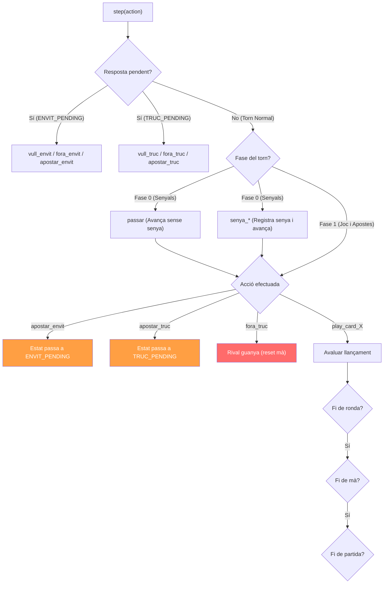
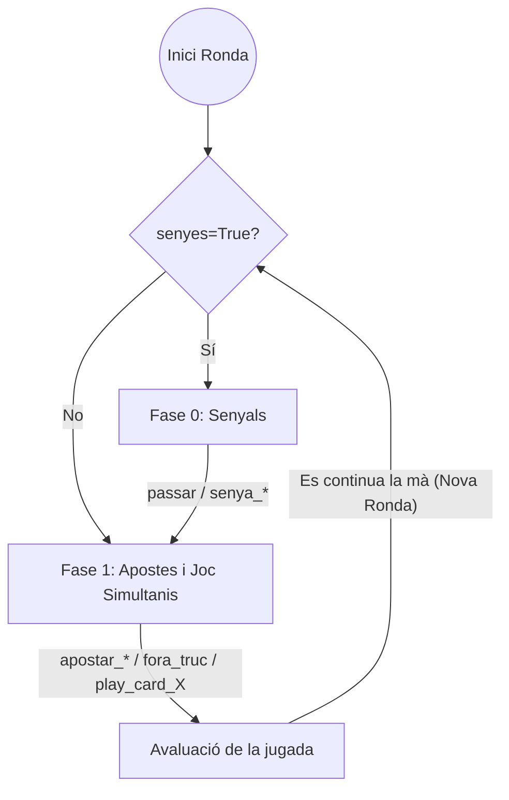
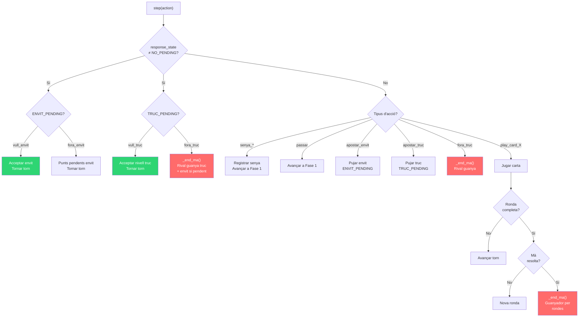

# 2. Lògica del Joc (TrucGame i TrucGameMa)

#### Motor Lògic (`game.py`)

`TrucGame` és la classe central que implementa tota la lògica del joc del Truc. Gestiona l'estat complet de la partida: jugadors, cartes, apostes (Truc i Envit), rondes, i puntuació global. Actua com a **motor del joc**, independent de la interfície d'entorn (`env.py`).

##### Constructor `__init__`

```python
TrucGame(num_jugadors=2, cartes_jugador=3, senyes=False, puntuacio_final=24, player_class=TrucPlayer)
```

##### Paràmetres de configuració

| Paràmetre          | Defecte        | Descripció                                                                                       |
| :------------------ | :------------- | :------------------------------------------------------------------------------------------------ |
| `num_jugadors`    | 2              | Nombre de jugadors                                                                                |
| `cartes_jugador`  | 3              | Cartes repartides per mà                                                                         |
| `senyes`          | False          | Activa la fase de senyals                                                                         |
| `puntuacio_final` | 24             | Punts per guanyar la partida                                                                      |
| `player_class`    | `TrucPlayer` | Classe o**diccionari** `{id: Classe}` dels jugadors (permet partides mixtes Human vs Bot) |
| `verbose`         | False          | Mode de debug per consola                                                                         |

---

##### Variables Internes del Joc

###### Jugadors i Rols (Carpeta `joc/entorn/rols/`)

El joc utilitza la separació d'interessos instanciant tres elements crucials dedicats que modulen una partida:

| Variable      | Tipus                | Descripció                                   |
| :------------ | :------------------- | :-------------------------------------------- |
| `players`   | `list[TrucPlayer]` | Llista d'instàncies de jugadors              |
| `dealer`    | `TrucDealer`       | Gestiona la baralla i el repartiment          |
| `judger`    | `TrucJudger`       | Determina guanyadors de rondes, envits i mans |
| `np_random` | `RandomState`      | Generador aleatori per reproducibilitat       |

**Detall de les classes de Rol**:

- **`TrucDealer`**: Classe responsable de gestionar la baralla (`init_joc_cartes()`). Es crida al començar cada mà per regenerar les cartes completament crues, barrejar-les (`shuffle()`) mitjançant el `np_random` de la sessió i repartir seqüencialment a la referència `hand` local de cada jugador (`deal_cards()`).
- **`TrucJudger`**: És el cervell arbitrari sense estat (stateless). Inclou totes les jerarquies de força mallorquina, on detecta des dels *11 de Bastos* fins als *Quatres*. Incorpora el mètode `guanyador_ronda()` pel càlcul d'empats entre equips; el complex mètode `guanyador_ma()` per predir qui arriba abans a la majoria absoluta, i molt especialment `get_envit_ma()`, responsable de llegir combinacions del mateix pal calculant correctament els 20 punts base del joc.
- **`TrucPlayer`**: És l'encarnació de l'agent. Manté dues col·leccions: `hand` (cartes actuals) i `initial_hand` (la fotografia inicial, obligatòria en cas que l'envit es resolgui a final de mà però el jugador ja hagi consumit les cartes per avaluar). A banda de l'estat, inclou un punt vital d'injecció: accepta com a paràmetre local la instància d'un `model`. Això permet cridar elegantment `triar_accio(estat)` des de fora delegant les prediccions a un agent extern, o resolvent un fallback bot `random_choice` per defecte intern.

###### Control del Torn

| Variable           | Tipus             | Descripció                                                                |
| :----------------- | :---------------- | :------------------------------------------------------------------------- |
| `ma`             | `int`           | ID del jugador que és**mà** (comença jugant). Rota cada mà nova. |
| `current_player` | `int`           | ID del jugador que ha d'actuar ara                                         |
| `turn_player`    | `int`           | Jugador amb el torn "real" (es restaura després d'una aposta)             |
| `turn_phase`     | `int`           | Fase actual del torn: 0=Senyals, 1=Apostes i Joc                           |
| `response_state` | `ResponseState` | Estat de resposta pendent                                                  |

**Significat dels valors de l'estat de resposta pendent:**

| Valor                 | Significat                                                       |
| :-------------------- | :--------------------------------------------------------------- |
| `NO_PENDING` (0)    | No hi ha cap aposta pendent de resposta                          |
| `TRUC_PENDING` (1)  | S'ha cantat Truc i s'espera resposta (Vull / Fora / Re-apostar)  |
| `ENVIT_PENDING` (2) | S'ha cantat Envit i s'espera resposta (Vull / Fora / Re-apostar) |

**Important:** Mentre hi ha una resposta pendent, el jugador contrari **només** pot respondre a l'aposta (vull/fora/re-apostar). No pot jugar cartes ni fer altres accions.

###### Puntuació i Historial

| Variable          | Tipus           | Descripció                                        |
| :---------------- | :-------------- | :------------------------------------------------- |
| `score`         | `list[int]`   | Puntuació global `[equip_0, equip_1]`           |
| `hist_cartes`   | `list[tuple]` | Historial de cartes jugades:`(player_id, carta)` |
| `hist_senyes`   | `list[tuple]` | Historial de senyals:`(player_id, senya)`        |
| `round_counter` | `int`         | Nombre de rondes completades a la mà actual       |
| `cartes_ronda`  | `list[tuple]` | Cartes jugades a la ronda en curs                  |
| `ronda_winners` | `list[int]`   | Guanyadors de cada ronda (-1 = empat)              |
| `payoffs`       | `list[int]`   | Recompenses finals per a l'entorn RL               |

###### Estat del Truc (Aposta de cartes)

| Variable                | Tipus   | Descripció                                                               |
| :---------------------- | :------ | :------------------------------------------------------------------------ |
| `truc_level`          | `int` | Nivell actual del Truc (punts en joc per cartes)                          |
| `truc_owner`          | `int` | Qui ha cantat l'última aposta de Truc (-1 = ningú)                      |
| `previous_truc_level` | `int` | Nivell anterior (per si diuen "Fora", saben quants punts guanya el rival) |

**Seqüència d'escalada del Truc:**
`1 (per defecte) -> 3 (Truc) -> 6 (Retruc) -> 9 (Val Nou) -> 24 (Joc Fora)`

###### Estat de l'Envit (Aposta d'envit)

| Variable                 | Tipus    | Descripció                                          |
| :----------------------- | :------- | :--------------------------------------------------- |
| `envit_level`          | `int`  | Nivell actual de l'Envit                             |
| `envit_owner`          | `int`  | Qui ha cantat l'últim Envit (-1 = ningú)           |
| `envit_accepted`       | `bool` | Si l'envit ha estat acceptat                         |
| `previous_envit_level` | `int`  | Nivell anterior (per calcular punts si diuen "Fora") |

**Seqüència d'escalada de l'Envit:**
`0 (no cantat) -> 2 (Envit) -> 4 (Un mes) -> 6 (Dos mes) -> Tots (Falta Envit)`

**Regla "Tots" (Falta Envit):**
Si cap equip supera els 12 punts, val 24 (guanya partida). Si algun equip supera els 12, val `24 - puntuacio_del_lider`.

---

##### Mètodes Principals

###### `init_game()` -> Inicialitzar Partida

1. Crea els jugadors amb `player_class`
2. Crea el dealer i el judger
3. Barreja i reparteix cartes
4. Inicialitza totes les variables d'estat
5. Retorna `(estat, current_player)`

###### `step(action)` -> Avançar el Joc

El mètode principal. Rep una acció (int o string) i actualitza l'estat.

**Flux de decisions:**



###### `get_state(player_id)` -> Construir Estat

Retorna un diccionari amb tota la informació visible pel jugador.

###### `get_legal_actions()` -> Accions Legals

Determina quines accions pot fer el jugador actual segons la situació:

| Situació              | Accions disponibles                                                      |
| :--------------------- | :----------------------------------------------------------------------- |
| `ENVIT_PENDING`      | `vull_envit`, `fora_envit`, (+ `apostar_envit` si `level <= 6`)  |
| `TRUC_PENDING`       | `vull_truc`, `fora_truc`, (+ `apostar_truc` si `level < 24`)     |
| Fase 0 (Senyals)       | `passar` + totes les `senya_*`                                       |
| Fase 1 (Joc & Apostes) | `apostar_envit`¹ , `apostar_truc`², `fora_truc`, `play_card_X` |

> ¹ Només si `envit_level == 0` i `round_counter == 0` (primera ronda, sense envit previ)
> ² Només si el jugador actual no és el propietari de l'última aposta de Truc

###### `_reset_hand_state()` -> Reset per Nova Mà

Quan acaba una mà (per guanyador o per "Fora"):

1. Avança `ma` al següent jugador
2. Barreja i reparteix de nou
3. Reseteja totes les variables de Truc, Envit, rondes i historials

###### `is_ma_over()` i `is_over()` -> Fi de Mà / Partida

Distingeix els dos nivells d'acabament:

- `is_ma_over()`: retorna `True` si la **mà actual** ha acabat (hi ha guanyador o s'han esgotat les rondes).
- `is_over()`: retorna `True` si la **partida** ha acabat (`max(score) >= puntuacio_final`).

###### Recompenses i Recompenses Intermèdies (Reward Shaping)

El motor principal (`TrucGame`) utilitza un sistema sofisticat de *Reward Shaping* per tal d'atorgar feedback a l'agent d'Aprenentatge per Reforç pas a pas, evitant patir el problema de "recompensa dispersa" (Sparse Reward) a partides llargues a 24 punts. Es manifesta mitjançant dos vectors:

1. **Recompenses Finals (`get_payoffs`)**: S'atorga únicament al final de la partida sencera (`+1.0` per l'equip guanyador, `-1.0` pel perdedor i `0.0` per empirismes tancats a empat d'interrupció).
2. **Recompenses Intermèdies (`reward_intermedis`)**: En cada `step`, aquest array de mida `[0.0, 0.0]` s'omple indicant l'abast local de la jugada del moment (normalitzat sobre `/24.0` punts possibles de la partida o amb pes dinàmic):
   - **Envit Acceptat**: No té una modificació directa quan l'acció és `vull_envit`, però indirectament puntua sobre l'avantatge (+1.0x els punts pactats per l'equip que matemàticament els guanya, -1.0x pel qui perd).
   - **Envit No Volgut (`fora_envit`)**: L'equip que força que l'altre no vulgui adquireix un *plus ofensiu* d'incentiu (+1.5x) i qui es retira estratègicament amb pèssimes cartes una retirada no molt castigada (-1.0x).
   - **Truc Forçat (`fora_truc` responsiu)**: L'equip agressiu (forçador del fora) adquireix l'incentiu de la retirada del rival guanyant +1.5x, i el retirat rep un càstig teòric menor (-1.0x).
   - **Truc No Volgut (`fora_truc` voluntari)**: Menys dràstic que si prové d'una resposta: oponent adquireix el benefici calculat base (+1.0x) però tu reps una penalització per fugir directament de la ronda quan tocava parlar normal (-1.2x).
   - **Guanyador del Truc (mà neta)**: Com de normal, l'equip adquireix el factor estricte base de +1.0x i l'oponent cau a -1.0x.
   - **Guanyar una Ronda (Sub-step d'interès)**: És l'únic que utilitza el factor `_pes_ronda()`. Guanyar rep sempre una empenta positiva moderada-forta de base `+0.40 * pes`, alhora que l'adversari obté una reducció de `-0.20 * pes`. Els *pesos* decauen per reduir importància: (2.0 per Ronda 1, 1.0 per Ronda 2, i 0.5 per Ronda 3), a menys que perdre la ronda suposi la caiguda final, moment en que el valor rep una penalització x1.5 per incitar les IA a lluitar en punts de vida o mort.

---

##### Fases del torn i Joc

L'evolució de l'entorn ha reduït l'estat d'un torn a únicament dues fases per eficiència al Reinforcement Learning. No hi ha divisió "aposta/només-jugar" artificial.



**Nota:** Si `senyes=False`, la fase 0 se salta completament i l'agent i la mà comencen sempre directament disparant la fase 1.

## Entorn d'Entrenament per Mans (joc_ma)

`TrucGameMa` és una variant de `TrucGame` (veure [doc_tfg.md](doc_tfg.md) §Motor Lògic) dissenyada perquè **cada mà sigui un episodi complet**.

#### Constructor

```python
TrucGameMa(num_jugadors=2, cartes_jugador=3, senyes=False,
           puntuacio_final=999, player_class=TrucPlayer, verbose=False)
```

**Diferència clau**: `puntuacio_final=999` per defecte. Com que cada mà aporta un màxim de ~24 punts i l'episodi acaba amb la primera mà, la puntuació final mai s'assoleix. Actua com una salvaguarda per evitar que `is_over()` retorni `True` prematurament.

#### Variable `reward_intermedis` — Reward Net de la Mà

A diferència de `TrucGame`, que emet rewards intermedis granulars (per ronda, per envit acceptat, etc.), `TrucGameMa` acumula **un únic reward net** al final de la mà:

```python
self.reward_intermedis = [0.0, 0.0]  # [equip_0, equip_1]
```

Aquesta variable es reinicialitza a `[0.0, 0.0]` a cada `step()` i només s'omple quan la mà acaba via `_end_ma()`.

#### Mètode `_end_ma()` — Finalització de Mà i Càlcul de Reward

```python
def _end_ma(self, winner_truc, pts_truc, winner_envit=None, pts_envit=0):
```

| Paràmetre       | Tipus        | Descripció                                              |
| :--------------- | :----------- | :------------------------------------------------------- |
| `winner_truc`  | `int`      | Equip guanyador del truc (0 o 1)                         |
| `pts_truc`     | `int`      | Punts de truc guanyats (1, 3, 6, 9, 24)                  |
| `winner_envit` | `int\|None` | Equip guanyador de l'envit (o `None` si no s'ha jugat) |
| `pts_envit`    | `int`      | Punts d'envit guanyats (0, 1, 2, 4, 6, fins a 24)        |

**Càlcul del reward:**

```python
# 1. Sumar punts al score global (per estadístiques)
self.score[winner_truc] += pts_truc
if winner_envit is not None:
    self.score[winner_envit] += pts_envit

# 2. Calcular reward net normalitzat
self.reward_intermedis[winner_truc] += pts_truc / 24.0
self.reward_intermedis[1 - winner_truc] -= pts_truc / 24.0
if winner_envit is not None:
    self.reward_intermedis[winner_envit] += pts_envit / 24.0
    self.reward_intermedis[1 - winner_envit] -= pts_envit / 24.0

# 3. Senyalitzar done
return self.get_state(self.current_player), None  # None = done
```

**Exemples pràctics de càlcul de Reward**:

1. **Mà simple (sense apostes)**: L'equip guanya per rondes sense que ningú hagi apostat res extra.
   - Resultat: +1 pt Truc.
   - Reward net guanyador: `1 / 24.0 = +0.0416` (i `-0.0416` pel rival).
2. **Batalla equilibrada**: Es juga i s'accepta un Envit simple (2) i el joc escala fins al Retruc (6). L'Equip 0 guanya les cartes però l'Equip 1 portava el millor Envit.
   - Equip 0: +6 pts Truc, Equip 1: +2 pts Envit.
   - Reward net Equip 0: `(6 - 2) / 24.0 = +0.166`
   - Reward net Equip 1: `(2 - 6) / 24.0 = -0.166`
3. **Fugida d'urgència (`fora_truc`)**: El rival canta Truc, i l'agent reconeix la pèrdua d'estadística i es retira automàticament concedint 1 punt.
   - Resultat: Rival guanya +1 pt Truc.
   - Reward net guanyador: `+0.0416`.
   - Reward net agent (perdedor): `-0.0416` *(l'agent ha optimitzat: és millor un -0.041 avui que un desastrós -0.125 havent acceptat amb males cartes)*.
4. **Falta en Envit acceptada, falten 10 punts i guanya el Truc normal**:
   - Punts de Truc: 1 per guanyar
   - Punts d'Envit totals matemàtics de la Falta: 10
   - Reward net guanyador total: `11 / 24.0 = +0.458` (i `-0.458` pel perdedor)

#### Mètode `step()` — Flux de Decisions

El `step()` de `TrucGameMa` és funcionalment idèntic al de `TrucGame` en la lògica de regles (apostes, cartes, etc.), però difereix en **com finalitza la mà**:



**4 camins cap a `_end_ma()`:**

1. **`fora_truc` en resposta** (línia 169): El jugador rebutja una aposta de truc → el rival guanya pel nivell anterior.
2. **`fora_truc` voluntari** (línia 237): El jugador es retira sense que li hagin cantat → el rival guanya pel nivell actual.
3. **Guanyador per rondes** (línia 272-284): Un equip guanya suficients rondes → el guanyador de la mà rep els punts de truc.
4. **`fora_truc` en resposta** amb envit pendent: Es resol l'envit primer, després es tanca la mà.

#### Mètode `_resoldre_envit_si_pendent()`

Quan la mà acaba (per qualsevol camí), cal comprovar si hi havia un envit acceptat sense resolre:

```python
def _resoldre_envit_si_pendent(self):
    if self.envit_accepted and self.punts_envit_pendents is None:
        all_hands = [p.initial_hand for p in self.players]
        winner_team = self.judger.guanyador_envits(all_hands, self.ma)
        self.punts_envit_pendents = (winner_team, self.envit_level, punts_envit)
```

Utilitza les **mans inicials** (`initial_hand`) per calcular l'envit, no les mans actuals (que poden tenir cartes jugades).

#### Diferències Clau amb `TrucGame.step() `vs `TrucGameMa.step()`)

| Tipologia Explicada                    | `TrucGame.step()` (Partida Sencera)                                                                             | `TrucGameMa.step()` (Per Mans)                                                                                      |
| :------------------------------------- | :---------------------------------------------------------------------------------------------------------------- | :-------------------------------------------------------------------------------------------------------------------- |
| Mètode de Fi de Joc                   | `_reset_hand_state()` → nova mà, contínua incrementant Score.                                                | `_end_ma()` → `(state, None)` → finalitza Episodi immediat.                                                     |
| Quan guanya mà per rondes             | Suma directament a `score += pts`, dispara el `_reset_hand_state()`.                                          | `_end_ma()` → l'agent intercepta `None` de sortida final de *step*.                                            |
| **Rewards intermedis per Ronda** | **`+0.40 × pes_ronda / -0.20 × pes_ronda`** (Shaping Dinàmic).                                         | Cap — El flux considera tota la mà en un únic paquet neutre final.                                                 |
| **Rewards per Envit i Apostes**  | Recompenses instantànies al `step` via assimetries (x1.5 / x1.0, etc).                                         | **`±(pts/24)` integrals** purs simètrics només enviats quan surt per `_end_ma()`.                        |
| Com s'aprèn a llarg termini           | Acumulant el total d'alegries basades en els subtorns i resoldre l'objectiu general a mesura que decau$\gamma$. | Aprenentatge miòpic (cada mà val pel que és). Convergència espectacular però purament tècnica i tàctica local. |
