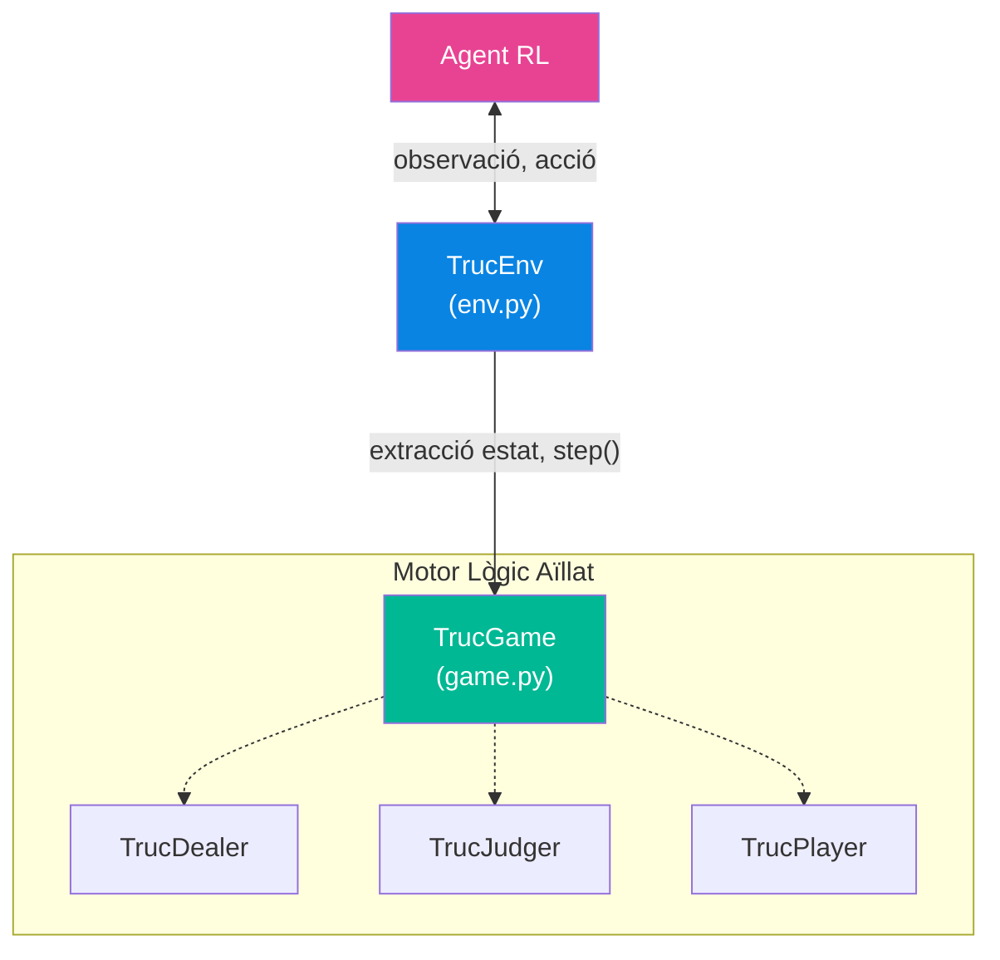

# 3. Entorns de Simulació per RL


`TrucEnv` és l'entorn que adapta la lògica del joc (`TrucGame`) a la interfície estàndard de **RLCard**. La seva funció principal és **transformar l'estat del joc** (diccionaris llegibles per humans) en **vectors numèrics** (observacions) que un agent de Reinforcement Learning pot processar.

##### Arquitectura



`TrucEnv` hereta de `rlcard.envs.Env`, que proporciona el bucle estàndard `reset()` -> `step()` -> `get_payoffs()`.

##### Constructor de l'Entorn `__init__`

```python
TrucEnv(config)
```

##### Paràmetres de configuració (diccionari `config`)

| Clau                | Defecte | Descripció                                                                                           |
| :------------------ | :------ | :---------------------------------------------------------------------------------------------------- |
| `num_jugadors`    | 2       | Nombre de jugadors                                                                                    |
| `cartes_jugador`  | 3       | Cartes per jugador                                                                                    |
| `puntuacio_final` | 24      | Punts per guanyar                                                                                     |
| `senyes`          | False   | Activar fase de senyals                                                                               |
| `player_class`    | None    | Classe dels jugadors (e.g.`HumanPlayer`) o **diccionari** `{id: Classe}` per barrejar tipus |
| `allow_step_back` | False   | Permetre desfer passos (heretat d'RLCard)                                                             |
| `seed`            | None    | Seed per reproducibilitat                                                                             |
| `verbose`         | False   | Mode de debug                                                                                         |

---

##### Variables Internes de l'Entorn

###### Mapeig de Cartes i Senyals

| Variable       | Tipus              | Descripció                                             |
| :------------- | :----------------- | :------------------------------------------------------ |
| `cartes`     | `list[str]`      | Llista de totes les cartes del joc (36 cartes)          |
| `carta_map`  | `dict[str, int]` | Mapa `carta -> index` per codificar cartes a one-hot  |
| `signal_map` | `dict[str, int]` | Mapa `senya -> index` per codificar senyals a one-hot |

###### Dimensions de l'Espai d'Estat

| Variable                 | Valor (exemple 2J, 3C, -senyes) | Descripció                                                    |
| :----------------------- | :------------------------------ | :------------------------------------------------------------- |
| `num_cartes`           | 36                              | Cartes úniques a la baralla                                   |
| `espai_joc_cartes`     | 37                              | `num_cartes + 1` (inclou slot "buit")                        |
| `espai_hist_cartes`    | 6                               | `num_jugadors * cartes_jugador` (slots historial)            |
| `espai_senya`          | 10                              | `len(ACTIONS_SIGNAL) + 1` (9 senyals + buit)                 |
| `espai_hist_senyes`    | 0 o 6                           | 0 si `senyes=False`, sinó `num_jugadors * cartes_jugador` |
| `espai_info_publica`   | 10                              | Puntuacions + apostes + situació                              |
| **`state_size`** | **343** (sense senyes)    | Mida total del vector d'observació                            |

###### Espais per a RLCard

| Variable         | Descripció                                                                 |
| :--------------- | :-------------------------------------------------------------------------- |
| `state_shape`  | `[[state_size]] * num_jugadors` - dimensions de l'observació per jugador |
| `action_shape` | `[[len(ACTION_LIST)]] * num_jugadors` - 18 accions possibles              |

---

##### Estructura de l'Observació `_extract_state(state)`

Transforma el diccionari d'estat del joc en un tensor numèric i context de tipus `np.float32`. L'estructura s'ha canviat a un format **multi-entrada**:

L'observació extreta és un diccionari amb dues claus rellevants globals sota la sub-clau `obs`:

1. **`obs_cartes`**: Un tensor 3D de dimensions `(6 canals, 4 pals, 9 rangs)`. Les posicions marcades són valors one-hot a l'índex corresponent.
2. **`obs_context`**: Un tensor 1D (vector) de 23 dimensions flotants (`(23,)`) amb variables contínues (escalables) i valors one-hot del context.

**Total variables `state_size`**: `6 * 4 * 9 + 23` = **239** mides.

###### 1. Canals de Cartes (`obs_cartes` tensor (6,4,9))

Codificació on-hot segons la utilitat i propietat de destí per cada carta segons l'observador:

- **Canal 0**: Mà actual del jugador
- **Canals 1-4**: Historial de les cartes jugades d'ell mateix (1), Rival 1 (2), Company en mode 4 jugadors (3) i Rival 2 (4).
- **Canal 5**: Cartes assenyalades per les senyes (si actives) a l'historial del company.

###### 2. Vector de Context (`obs_context` tensor (23,))

| Posició | Contingut                 | Descripció i format                      |
| :------- | :------------------------ | :---------------------------------------- |
| 0        | `puntuacio` Equip Propi | Escalat `punts / 24`                    |
| 1        | `puntuacio` Equip Rival | Escalat `punts / 24`                    |
| 2        | `estat_truc.level`      | Nivell actual del Truc (`level / 24`)   |
| 3        | `estat_envit.level`     | Nivell actual de l'Envit (`level / 24`) |
| 4        | `fase_torn`             | Fase actual (0 o 1)                       |
| 5        | `comptador_ronda`       | Rondes completades (`ronda / cartes`)   |
| 6-9      | `ma_offset`             | Qui és mà (one-hot relatiu)             |
| 10-13    | `truc_owner_offset`     | Qui ha cantat Truc (one-hot relatiu)      |
| 14-16    | `envit_owner_offset`    | Qui ha cantat Envit (one-hot relatiu)     |
| 17       | `rondes_guanyades_prop` | Rondes guanyades propi (`rondes / 3`)    |
| 18       | `rondes_guanyades_riv`  | Rondes guanyades rival (`rondes / 3`)    |
| 19       | `winner_r1`             | Guanyador R1 (1.0=jo, -1.0=rival, 0.0=empat/no jugada) |
| 20       | `winner_r2`             | Guanyador R2 (1.0=jo, -1.0=rival, 0.0=empat/no jugada) |
| 21       | `envit_accepted`        | 1.0 si acceptat, 0.0 si no               |
| 22       | `response_state`        | 0.0/0.5/1.0 (NO/TRUC/ENVIT PENDING)      |

###### Retorn de `_extract_state`

```python
{
    'obs': {
        'obs_cartes': np.array([...]),  # Tensor (6,4,9) per la xarxa neuronal espacial
        'obs_context': np.array([...])  # Vector de context (23,) de variables contínues 
    },
    'legal_actions': OrderedDict,     # Accions legals com a OrderedDict
    'raw_obs': state,                 # Estat original (diccionari llegible)
    'raw_legal_actions': ['passar', 'apostar_truc', ...],  # Noms de les accions
    'action_record': self.action_recorder  # Historial d'accions (d'RLCard)
}
```

---

##### Altres Mètodes i Fites

L'entorn cedeix tota l'autonomia al mecanisme subjacent (`TrucGame`) per al càlcul de les recompenses (per més detalls relatius al disseny asimètric dels rewards, refèrir-se a [[2_Logica_Joc]]):

1. **Reward final `get_payoffs()`**: Obté la referència matemàtica de +1.0 o -1.0 directament recollint-la del motor de joc.
2. **El Problema del Reward Intermedi a RLCard**: La llibreria RLCard està dissenyada per només emprar el *Payoff* final en l'última transició, assignant recursivament una recompensa de `0.0` a qualsevol step intermedi. Per solucionar l'Sparse Reward, el projecte implementa un encaminador personal.

###### `reorganize_amb_rewards(trajectories, payoffs)`

Funció personalitzada (tècnica de *Reward Injection*) dissenyada per sobreescriure el tractament de trajectòries per defecte d'RLCard `[estat_actual, acció, state_next]`.

L'encaminador llegeix la propietat `reward_intermedis` continguda de forma bruta en els raw_obs i transforma la memòria RAM local substituint aquells zero cecs precaris inserint manualment la recompensa que tocava per cada segment individual del procés, deixant un tensor impecable llest per a ser empassat pels aprenents RL d'alt rendiment:  `[estat_actual, acció, *recompensa_intermedia_real*, next_state_raw, done]`.

###### `_decode_action(action_id)` -> Descodificar Acció

Converteix un índex d'acció numèric al seu nom string:

```python
ACTION_LIST[action_id]  # e.g. 0 -> 'play_card_0', 4 -> 'apostar_truc'
```

###### `_get_legal_actions()` -> Accions Legals

Aquest mètode de l'entorn delega directament a `TrucGame.get_legal_actions()`, que és on realment es calcula la llista d'accions permeses. Retorna una **llista d'índexs** (enters) que representen les accions vàlides.


## TrucEnvMa — Adaptador RLCard per Mans


`TrucEnvMa` és funcionalment idèntica a `TrucEnv` (veure el capítol superior sobre l'extracció d'estats) en tot el que respecta a l'extracció d'observacions. La **única diferència** és el motor de joc subjacent:

| Aspecte | `TrucEnv` | `TrucEnvMa` |
|:--------|:----------|:-------------|
| Motor de joc | `TrucGame` | `TrucGameMa` |
| `self.name` | `'truc'` | `'truc_ma'` |
| Observació `obs_cartes` | `(6, 4, 9)` ✓ | `(6, 4, 9)` ✓ — **idèntica** |
| Observació `obs_context` | `(23,)` ✓ | `(23,)` ✓ — **idèntica** |
| `state_size` | `239` | `239` — **idèntic** |
| `_extract_state()` | Codi idèntic | Codi idèntic |

Aquesta identitat d'observacions és deliberada: permet que **el mateix model neuronal** (MLP o GRU) pugui entrenar-se amb qualsevol dels dos entorns sense cap modificació arquitectural. L'única variable que canvia és la **durada i reward de l'episodi**.

#### Estructura de l'Observació (recordatori)

Com a referència ràpida (detalls complets just abans en aquest mateix document):

**`obs_cartes` (6, 4, 9)** — Tensor de cartes one-hot:
- Canal 0: Mà actual del jugador
- Canals 1-4: Historial de cartes (propi, rival 1, company, rival 2)
- Canal 5: Cartes assenyalades pel company

**`obs_context` (23,)** — Vector de context:
- [0-1]: Puntuació equip propi/rival (÷24)
- [2-3]: Nivell truc/envit (÷24)
- [4]: Fase del torn
- [5]: Comptador ronda (÷cartes)
- [6-9]: One-hot qui és mà
- [10-13]: One-hot qui ha cantat truc
- [14-16]: One-hot qui ha cantat envit
- [17-18]: Rondes guanyades propi/rival (÷3)
- [19-20]: Guanyador R1/R2 (+1/−1/0)
- [21]: Envit acceptat (0/1)
- [22]: Response state (0.0/0.5/1.0)

