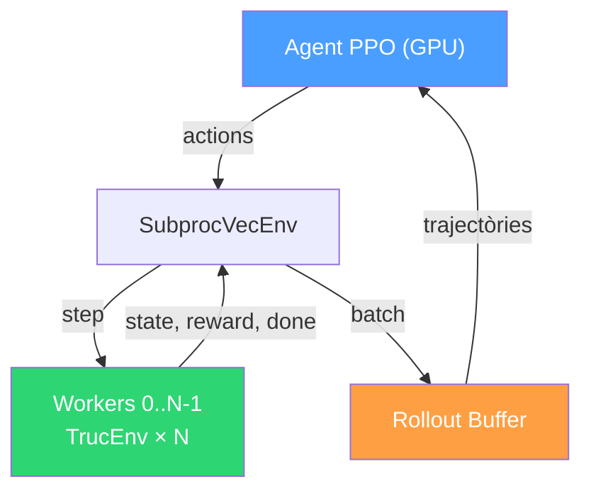
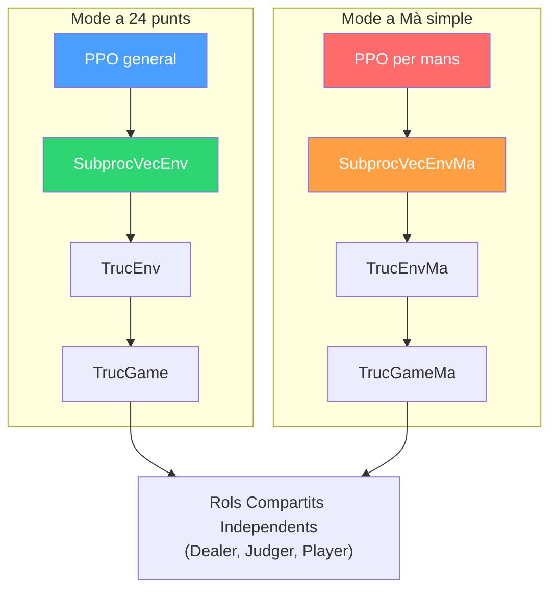

# 4. Entorns Paral·lels

### 1. Motivació i Context

L'entrenament d'agents amb algorismes **on-policy** com PPO requereix recollir grans volums de trajectòries absolutament noves abans de cada actualització de xarxa. A diferència d'algorismes com DQN que recorden experiència passada, PPO depèn de l'experiència en temps real.

Atès que el joc del Truc s'executa a la CPU, executar l'entorn de manera seqüencial faria que la GPU (on viu la xarxa neuronal) estigués el 90% del temps aturada esperant que la partida de cartes virtual s'acabés per fer càlculs. S'implementa l'arquitectura `SubprocVecEnv` per executar **N jocs simultàniament** en processos separats.

---

### 2. Arquitectura General del Paral·lelisme

L'orquestrador (`SubprocVecEnv`) llança diferents processadors clonats (Workers) basats en memòria aïllada i es comunica amb ells mitjançant Tubs bidireccionals (`mp.Pipe`). Aquest mecanisme és **Scatter-Gather**.
1. **Scatter (`step_async`)**: Manda a cadascun dels V entorns una acció a prendre, en paral·lel.
2. **Gather (`step_wait`)**: Escolta totes les respostes i bloqueja l'ordinador fins tenir tot el vector de conseqüències (nous estats i recompenses).

### 3. El Superpoder clau: Auto-Reset dels Workers

Una de les mecàniques estrella de la versió Paral·lela és que el training loop principal *NO necessita vigilar quan una partida s'acaba per reiniciar-la*.

Quan un worker finalitza la seva partida i la funció nativa d'avaluació retorna que no hi ha proper jugador (`next_player_id is None`), l'entorn intern:
1. Pilla la flag i la transforma a un bool de `done=True`.
2. Frena l'avaluació actual.
3. Executa un **`reset()` total per sota** immediat per generar una baralla nova en una fracció de mil·lisegon.
4. Extreu del sub-procés la tuple on viatgen tant el `done=True` necessari per la PPO, com el seu següent estat en joc! Així l'entorn no mor mai.

---

### 4. Partida vs Mà (`parallel_env` vs `parallel_env_ma`)

L'arquitectura Subproc s'encapsula en dos fitxers de configuracions bessones basats en el paradigma d'entrenament seleccionat. El rendiment, la velocitat d'iteracions i el maneig seqüencial varien dràsticament sota quin wrapper inicialitzem el multitasca:

| Aspecte | Partida Completa (`parallel_env.py`) | Per Mans (`parallel_env_ma.py`) |
|:--------|:-----------------|:---------|
| **Fitxers importats** | `game.py` → `env.py` | `game_ma.py` → `env_ma.py` |
| **Episodi** | Partida llarga fins 24 punts | 1 mà individual independent |
| **Steps per episodi** | Entre 30 i 200+ | Extremadament ràpid (3-10 steps) |
| **Reward shaping** | Sí (ronda, envit, truc, i asimetries) | No (reward net i contundent un cop resolt `_end_ma`) |
| **Freqüència de Resets** | Molt baixa (~5 cops cada 1000 steps) | Altíssima (~300 cops cada 1000 steps) |
| **Detecció reset (GRU)** | Detectant canvis al comptador numèric | Simple i directe per `done=True` de pas anterior |
| **Ús principal** | DQN antic i NFSP | Ràfega potent PPO MLP/GRU amb convergència forta |
| **Desavantatge** | Sovint genera sparse rewards que caven túnels cecs | L'agent miop oblida gestió de marcador general per partides llargues |

---

### 5. Bug i Descobriment: Senyalització de Fi de Partida i Rol dels Rewards Intermedis

#### 5.1 El Bug: `None` vs `self.current_player`

Durant la fase d'experimentació es va detectar un bug subtil a `game.py`. El contracte del sistema és que `step()` retorni `(state, None)` quan la partida acaba, i el `parallel_env` detecta el fi via `done = (next_p_id is None)`.

Tanmateix, dos dels tres camins de fi de partida retornaven `self.current_player` en comptes de `None`:

| Línia | Situació | Retornava | Correcte? |
|-------|----------|-----------|-----------|
| ~191 | `fora_truc` com a resposta, punts ≥ 24 | `self.current_player` | **No** |
| ~341 | Carta jugada, mà acabada, punts ≥ 24 | `self.current_player` | **No** |
| ~282 | `fora_truc` voluntari, punts ≥ 24 | `None` | Sí |

Conseqüència: quan la partida acabava pel camí més comú (carta jugada), el `parallel_env` mai detectava `done=True`. L'entorn quedava en un estat zombie — el marcador superava 24 però el joc continuava. Les úniques accions legals eren `apostar_truc` i `fora_truc`, generant cicles fins que l'agent triava `fora_truc` voluntari (l'únic camí que retornava `None` correctament).

Això explica per què en els experiments pre-fix `games_played` es congelava: Scratch a ~10k partides, Finetune a ~18k. Frozen no es congelava perquè la seva política usava `fora_truc` voluntari amb més freqüència.

**Correcció aplicada**: les línies 191 i 341 de `game.py` ara retornen `None` quan `max(score) >= puntuacio_final`.

#### 5.2 La Curiositat: Per Què els Experiments Pre-Fix Funcionaven?

Sorprenentment, els experiments amb el bug actiu donaven millors resultats que els post-fix en modes sense cos pre-entrenat (no_cos, scratch). La investigació va revelar el motiu:

**El model aprenia gràcies als `reward_intermedis`, no al payoff final.**

Els `reward_intermedis` codifiquen informació estratègica rica a cada step: guanyar rondes (+0.4×pes), forçar un `fora_truc` (+1.5×pts/24), perdre rondes (−0.2×pes), etc. Amb el bug, les partides zombie generaven molts steps amb aquests senyals intermedis, i el model aprenia per acumulació.

Un intent de compensar el bug fix afegint el payoff final (+1/−1) al moment de `done` va empitjorar els resultats: el senyal binari fort interfereix amb els gradients dels rewards intermedis, desorientant la política.

**Conclusió**: per a aquest entorn, el **reward shaping intermedi és l'autèntic motor d'aprenentatge** de PPO. El payoff terminal és redundant i perjudicial. L'arquitectura de `parallel_env` ja estava dissenyada correctament per aprofitar-ho — simplement el bug emmascara la importància d'aquest disseny.

---

### 6. Diagrama de Relacions Completes del Marc del Joc

Independentment del camí elegit (Partida o Mà), el sistema finalitza sempre derivant tot l'esforç cap a les 3 forces sense estat descrites al directori de regles de la lògica.

